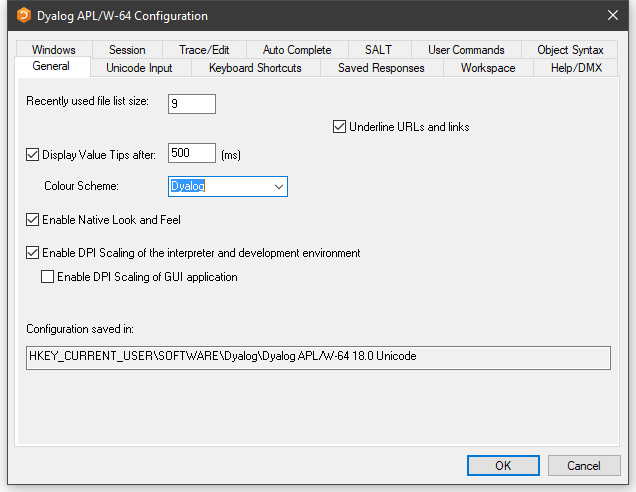

# General Tab

Configuration dialog: General

| Label | Parameter | Description |
| --- | --- | ---  |
| Recently used file list size | [File_Stack_Size (page 1)](../Installation%20and%20Configuration/Configuration%20Parameters/File_Stack_Size.htm#File_Stack_Size) | Specifies the number of the most recently used workspaces displayed in the File menu. |
| Underline URLs and links | [URLHighlight (page 1)](../Installation%20and%20Configuration/Configuration%20Parameters/URLHighlight.htm#URLHighlight) | Specifies whether or not URLs and links are highlighted in Session and Edit windows. |
| Display Value Tips | [Enabled (page 1)](../Installation%20and%20Configuration/Configuration%20Parameters/ValueTips/Enabled.htm#Enabled) | Specifies whether or not Value Tips are enabled. |
| Display Value Tips after | [Delay (page 1)](../Installation%20and%20Configuration/Configuration%20Parameters/ValueTips/Delay.htm#Delay) | Specifies the delay before APL displays a Value Tip. |
| Colour Scheme | [ColourScheme (page 1)](../Installation%20and%20Configuration/Configuration%20Parameters/ValueTips/ColourScheme.htm#ColourScheme) | Specifies the colour scheme used to display Value Tips. |
| Enable Native Look and Feel | [XPLookAndFeel (page 1)](../Installation%20and%20Configuration/Configuration%20Parameters/XPLookAndFeel.htm#XPLookAndFeel) | Specifies whether or not **Native Look and Feel** is enabled. This changes the appearance of user-interface controls such as Buttons in both the Session and the Dyalog GUI. |
| Enable DPI Scaling of the interpreter and development environment | [AutoDPI (page 1)](../Installation%20and%20Configuration/Configuration%20Parameters/AutoDPI.htm#AutoDPI) | Enables or disables DPI scaling for the APL Session |
| Enable DPI scaling of GUI application | [Dyalog_Pixel_Type (page 1)](../Installation%20and%20Configuration/Configuration%20Parameters/Dyalog_Pixel_Type.htm#Dyalog_Pixel_Type) | Determines whether Coord `'Pixel'` is treated as ScaledPixel or RealPixel. |
| Configuration saved in | [IniFile (page 1)](../Installation%20and%20Configuration/Configuration%20Parameters/IniFile.htm#IniFile) | Specifies the full pathname of the registry folder used by APL |
