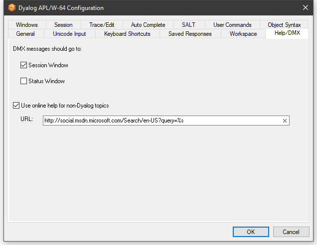

# Help/DMX Tab

Configuration dialog: Help/DMX

| Label | Parameter | Description |
| --- | --- | ---  |
| DMX messages should go to | [DMXOutputOnError (page 1)](../Installation%20and%20Configuration/Configuration%20Parameters/DMXOutputOnError.htm#DMXOutputOnError) | If checked, these boxes cause APL to display `⎕DMX` messages in the corresponding window(s). |
| Use Microsoft's documentation centre for non-Dyalog topics | [UseExternalHelpURL (page 1)](../Installation%20and%20Configuration/Configuration%20Parameters/UseExternalHelpURL.htm#UseExternalHelpURL) | If this option is checked, APL will look for help for external objects at Microsoft's documentation center, which is identified by the specified URL. |
| URL | [ExternalHelpURL (page 1)](../Installation%20and%20Configuration/Configuration%20Parameters/ExternalHelpURL.htm#ExternalHelpURL) | The URL for the documentation centre. |
