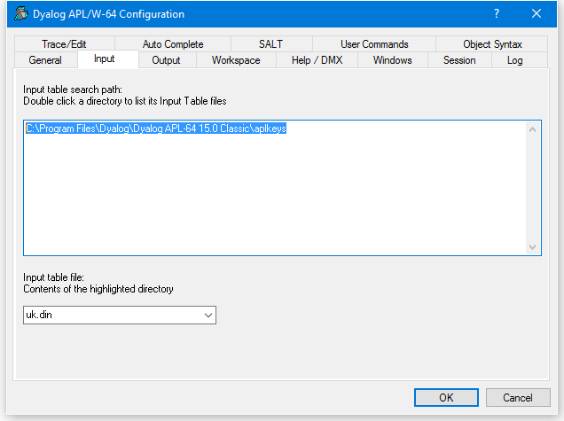

# Input Tab (Classic Edition Only)

Configuration dialog: Keyboard

| Label | Parameter | Description |
| --- | --- | ---  |
| Input table search path | [APLKeys (page 1)](../Installation%20and%20Configuration/Configuration%20Parameters/APLKeys.htm#APLKeys) | A list of directories to be searched for the specified input table |
| Input table file | [APLK (page 1)](../Installation%20and%20Configuration/Configuration%20Parameters/APLK.htm#APLK) | The name of the input table file (.DIN) |
