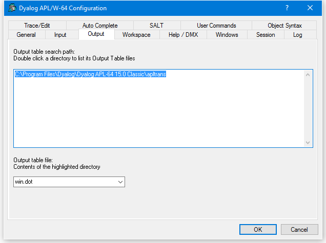

# Output Tab (Classic Edition Only)

Configuration dialog: Output

| Label | Parameter | Description |
| --- | --- | ---  |
| Output table search path | APLTrans (page 1) | A list of directories to be searched for the specified output table |
| Output table file | APLT (page 1) | The name of the output table file (.DOT) |
