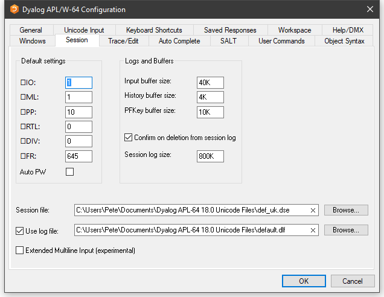

# Session Tab

Configuration dialog: Session

| Label | Parameter | Description |
| --- | --- | ---  |
| `⎕IO` | Default_IO (page 1) | The default value of `⎕IO` in a `clear ws` . |
| `⎕ML` | Default_ML (page 1) | The default value of `⎕ML` in a `clear ws` |
| `⎕PP` | Default_PP (page 1) | The default value of `⎕PP` in a `clear ws` . |
| `⎕RTL` | Default_RTL (page 1) | The default value of `⎕RTL` in a `clear ws` . |
| `⎕DIV` | Default_DIV (page 1) | The default value of `⎕DIV` in a `clear ws` . |
| `⎕WX` | Default_WX (page 1) | The default value of `⎕WX` in a `clear ws` . |
| Auto PW | Auto_PW (page 1) | If checked, the value of `⎕PW` is dynamic and depends on the width of the Session Window. |
| Input buffer size | Input_Size (page 1) | The size of the buffer used to store marked lines (lines awaiting execution) in the Session. |
| History size | History_Size (page 1) | The size of the buffer used to store previously entered (input) lines in the Session |
| PFKey buffer size | PFKey_Size (page 1) | The size of the buffer used to store PFKey definitions ( `⎕PFKEY` ) |
| Confirm on Deletion from Session log | Confirm_Session_Delete (page 1) | Specifies whether or not you are prompted to confirm the deletion of a line from the Session (and Session log). |
| Session log size | Log_Size (page 1) | The size of the Session log buffer. |
| Session file | Session_File (page 1) | The name of the Session file in which the definition of your session ( `⎕SE` ) is stored. |
| Use log file | Log_File_InUse (page 1) | Specifies whether or not the Session log is saved in a session log file |
| Use log file | Log_File (page 1) | The full pathname of the Session log file |
| Extended Multiline Input (experimental) | Dyalog_LineEditor_Mode (page 1) | Specifies whether or not multi-line input is enabled in the Session. |

Note: The value of size-related values defined in the above table is specified as an integer value followed by one of K, M, G, T, P or E. The default, where no character is included, is K (Kilobytes).
