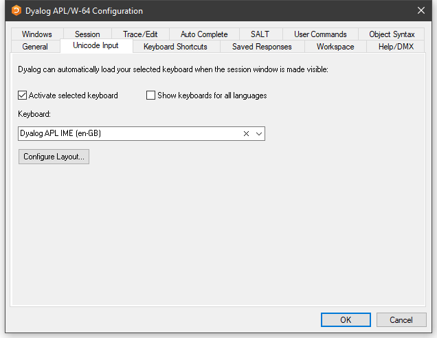
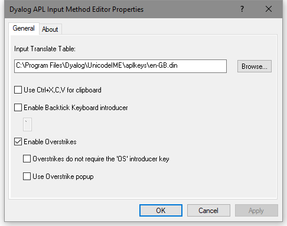

# Unicode Input Tab (Unicode Edition Only)

Unicode Edition can optionally select your APL keyboard each time you start APL. To choose this option, select one of your installed APL keyboards, enable the **Activate selected keyboard** checkbox, then click **OK**

Configuration dialog: Unicode Input

| Label | Parameter | Description |
| --- | --- | ---  |
| Activate selected keyboard | [InitialKeyboardLayoutInUse (page 1)](../Installation%20and%20Configuration/Configuration%20Parameters/InitialKeyboardLayoutInUse.htm#InitialKeyboardLayoutInUse) | If checked, the specified APL keyboard is activated on start-up. |
| Show keyboards for all Languages | [InitialKeyboardLayoutShowAll (page 1)](../Installation%20and%20Configuration/Configuration%20Parameters/InitialKeyboardLayoutShowAll.htm#InitialKeyboardLayoutShowAll) | If checked, all installed keyboards are displayed. Otherwise, only Dyalog keyboards are shown |
| Keyboard | [InitialKeyboardLayout (page 1)](../Installation%20and%20Configuration/Configuration%20Parameters/InitialKeyboardLayout.htm#InitialKeyboardLayout) | the APL keyboard to be selected. |
| Configure Layout |  | Displays thefollowng dialog box. |

## Input Method Editor Properties

Dyalog APL Input Method Editor Properties

| Label | Parameter | Description |
| --- | --- | ---  |
| Use Ctrl-X,C,V for clipboard | [UseXCV (page 1)](../Installation%20and%20Configuration/Configuration%20Parameters/UseXCV.htm#UseXCV) | specifies whether or not the commonly used keystrokes for copy, cut and paste  are recognised as such. |
| Enable Backtick Keyboard introducer |  |  |
| Enable Overstrikes | [ResolveOverstrikes (page 1)](../Installation%20and%20Configuration/Configuration%20Parameters/ResolveOverstrikes.htm#ResolveOverstrikes) | 1 = enable overstrikes. 0 = disable overstrikes |
| Overstrikes do not require the OS introducer key |  | 1 = IME identifies overstrike operation automatically 0 = IME requires the <OS> key (default Ctrl+Bksp) to signal an overstrike operation |
| Use Overstrike popup | [OverstrikesPopup (page 1)](../Installation%20and%20Configuration/Configuration%20Parameters/OverstrikesPopup.htm#OverstrikesPopup) | 1 = enable the overstrike popup. 0 = disable the overstrike popup |
