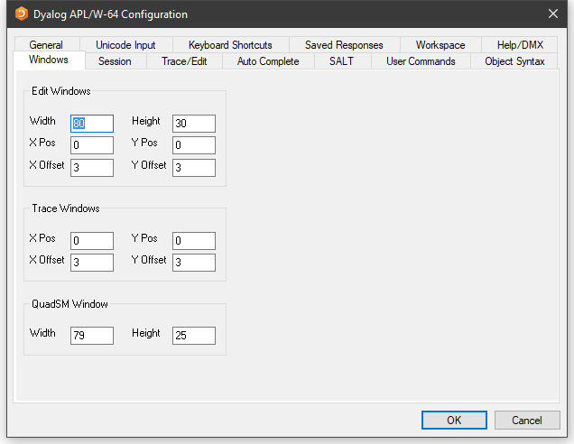

# Windows Tab

Configuration dialog: Windows (Edit Windows)

| Label | Parameter | Description |
| --- | --- | ---  |
| Width | Edit_Cols (page 1) | The maximum number of rows displayed in a new edit window. |
| Height | Edit_Rows (page 1) | The maximum number of columns displayed in a new edit window. |
| X Pos | Edit_First_X (page 1) | The initial horizontal position in characters of the first edit window. |
| Y Pos | Edit_First_Y (page 1) | The initial vertical position in characters of the first edit window. |
| X Offset | Edit_Offset_X (page 1) | The initial horizontal position in characters of the second and subsequent edit windows relative to the previous one. |
| Y Offset | Edit_Offset_Y (page 1) | The initial vertical position in characters of the second and subsequent edit windows relative to the previous one. |

Configuration dialog: Windows (Trace Windows)

| Label | Parameter | Description |
| --- | --- | ---  |
| X Pos | Trace_First_X (page 1) | The initial horizontal position in characters of the first trace window. |
| Y Pos | Trace_First_Y (page 1) | The initial vertical position in characters of the first trace window. |
| X Offset | Trace_Offset_X (page 1) | The initial horizontal position in characters of the second and subsequent trace windows relative to the previous one. |
| Y Offset | Trace_Offset_Y (page 1) | The initial vertical position in characters of the second and subsequent trace windows relative to the previous one. |

Configuration dialog: Windows (QuadSM Window)

| Label | Parameter | Description |
| --- | --- | ---  |
| Width | SM_Cols (page 1) | The width of the `⎕SM` and prefect windows. |
| Height | SM_Rows (page 1) | The height of the `⎕SM` and prefect windows. |
