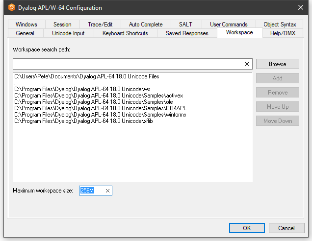

# Workspace Tab

Configuration dialog: Workspace

| Label | Parameter | Description |
| --- | --- | ---  |
| Workspace search path | [WSPath (page 1)](../Installation%20and%20Configuration/Configuration%20Parameters/WSPath.htm#WSPath) | A list of directories to be searched for the specified workspace when the user executes `)LOAD` . |
| Maximum workspace size | [MaxWS (page 1)](../Installation%20and%20Configuration/Configuration%20Parameters/MaxWS.htm#MaxWS) | The maximum size of the workspace. |
