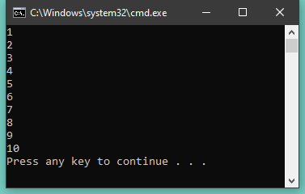
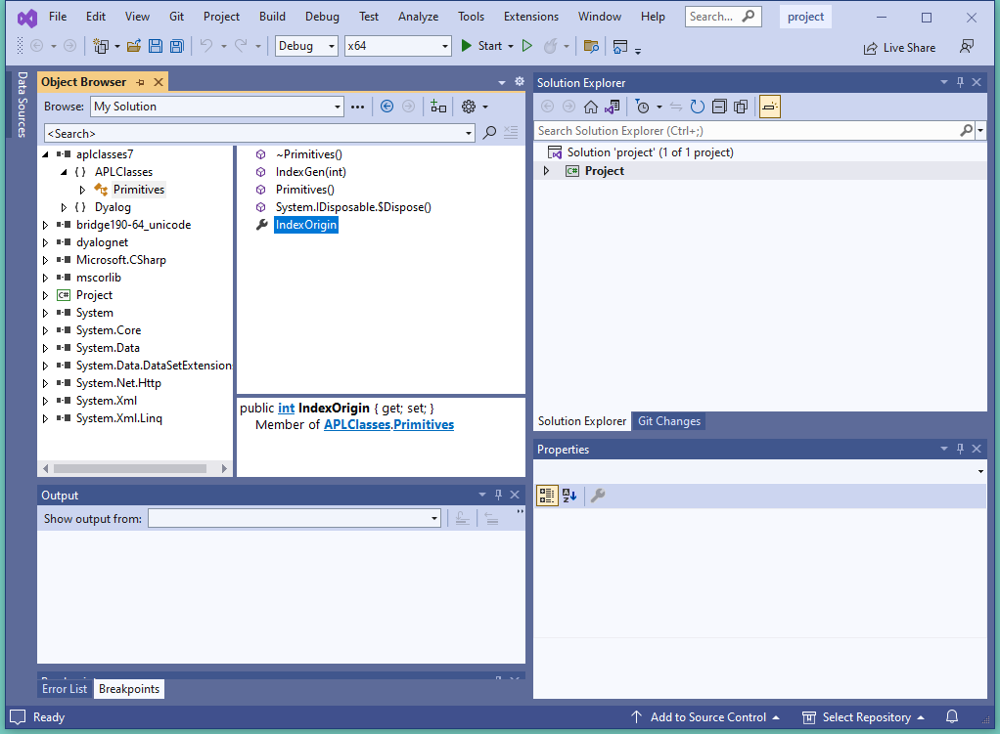
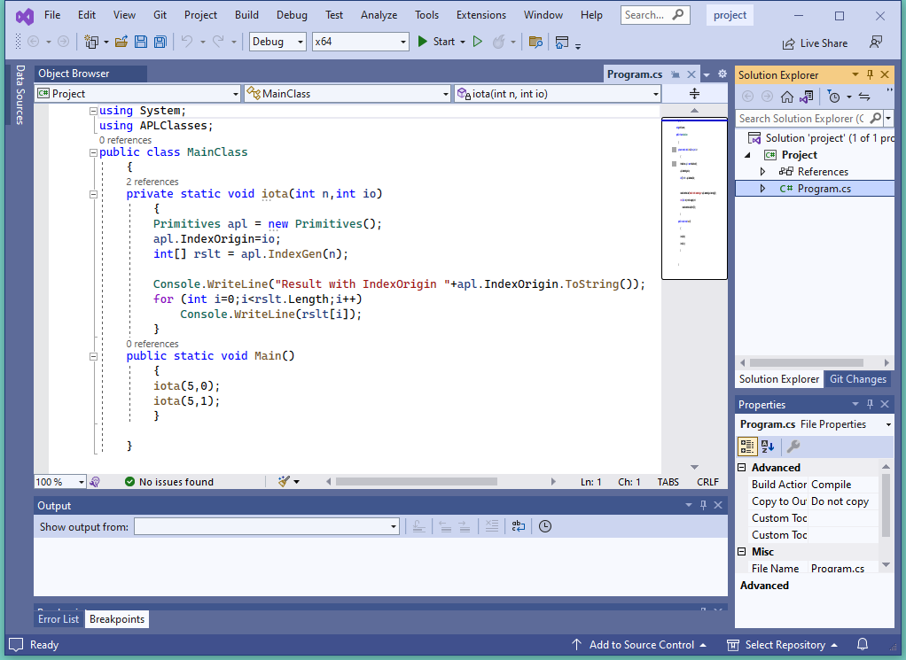

# Creating .NET Classes with APLScript

It is possible to define and use new .NET classes within an APLScript.

A class is defined by `:Class` and `:EndClass`statements. The methods provided by the class are defined as function bodies enclosed within these statements. Please see the Language Reference for a complete discussion of writing classes in Dyalog APL. This chapter will only provide a brief introduction to the subject, aimed specifically at APLScript.

You may also define sub-classes or nested classes using nested `:Class` and `:EndClass` statements.
```apl
      :Class Name: Type
```

Declares a new class called `Name`, which is based upon the Base Class `Type`, which may be any valid .NET Class.
```apl
      :EndClass
```

Terminates a class definition block

A class specified in this way will automatically support the methods, properties and events that it inherits from its Base Class, together with any new public methods that you care to specify.

However, the new class only inherits a default constructor (which is called with no parameters) and does not inherit all of the other private constructors from its Base Class. You can define a method to be a constructor using the :Implements Constructor declarative comment. Constructor overloading is supported and you may define any number of different constructor functions in this way, but they must have unique parameter sets for the system to distinguish between them.

You can create and use instances of a class by using the `⎕NEW` system function in statements elsewhere in the APLScript.

### Exporting Functions as Web Methods

Within a :Class definition block, you may define private functions and public functions. A public function is one that is exposed as a method and may be called by a client that creates an instance of your class. Public functions must have a section of *declaration*statements. Other functions are purely internal to the class and are not directly accessible by a client application.

The declaration statements for public functions perform the same task for an APLScript that is performed using the .NET Properties dialog box, or by executing SetMethodInfo in the Dyalog APL Session, prior to creating a .NET assembly. The following declaration statements may be used.
```apl
      :Access Public
```

Specifies that the function is callable. This statement applies only to a .NET class or to a Web Page and is not applicable to a Web Service.
```apl
      :Access WebMethod
```

Specifies that the function is callable as a Web Method. This statement applies only to a Web Service (.asmx). From version 11.0, the statement is equivalent to:
```apl
      :Access Public
      :Attribute System.Web.Services.WebMethodAttribute
      :Implements Constructor
```

Specifies that the function is a constructor for a new .NET class. This function must appear between `:Class` and `:EndClass` statements and this applies only to a Web Page (.aspx). See *Defining Classes in**APLScript* for further details. A constructor is called when you execute the `New` method in the class.

```apl
      :Signature result←fn type1 Name1, type2 Name2,..
```

Declares the result of the method to have a given data type, if any. It also declares parameters to the method to have given data types and names. `Namex` is optional and may be any well-formed name that identifies the parameter. This name will appear in the metadata and is made available to a client application as information. It is therefore sensible to choose meaningful names. The names you allocate to parameters have no other meaning and are not associated with the names of local variables that you may choose to receive them. However, it is not a bad idea to use the same local names as the public names of your parameters.

### A .NET Class example

The following APLScript illustrates how you may create a .NET Class using APLScript. The example class is the same as *Example 1* in Chapter 5. The APLScript code, saved in the file samples\aplclasses\aplclasses6.apl, is as follows:
```apl
:Namespace APLClasses
     
    :Class Primitives: Object
        ⎕USING←,⊂'System'
    :Access public
         
        ∇ R←IndexGen N
          :Access Public
          :Signature Int32[]←IndexGen Int32 number
          R←⍳N
        ∇
    :EndClass
     
:EndNamespace
```

This APLScript code defines a namespace called `APLClasses`. This simply acts as a container and is there to establish a .NET namespace of the same name within the resulting .NET assembly. Within `APLClasses` is defined a .NET class called `Primitives` whose base class is System.Object. This class has a single public method named `IndexGen`, which takes a parameter called `number` whose data type is Int32, and returns an array of Int32 as its result.

aplclasses6.apl is compiled to a .NET Assembly using the APLScript compiler with the /t:library  flag. For details, see the file aplclasses6\framework\build.bat.

Using VS, open the solution file d:\aplclasses\aplclasses6\Framework\project.sln and view aplclasses6.dll.


This shows that aplclasses6.dll contains a .NET namespace called APLClasses, which in turn contains the Primitives class. Primitives has a single method named IndexGen() which takes a number (an int).

Next, Display the c# program program.cs. This is the same program as in Example1.


Now click **Debug/Start Without debugging**(or press Ctrl+F5) to run the program. The results are shown in a console window.



This .NET Class can also be called from APL just like any other. For example:
```apl
      )CLEAR
clear ws
 
       'APLClasses, D:\aplclasses\aplclasses6\framework\bin\aplclasses6.dll'

      APL←⎕NEW Primitives
      APL.IndexGen 10
1 2 3 4 5 6 7 8 9 10
```

### Defining Properties

Properties are defined by `:Property` and `:EndProperty`statements. A property pertains to the class in which it is defined.
```apl
:Property Name
     ∇ C←get
[1]   :Access public
[2]   :Signature Double←get
[3]    C←...
     ∇
```

Declares a new property called `Name` whose data type is `System.Double.` The latter may be any valid .NET type which can be located through `⎕USING`.
```apl
:EndProperty
```

Terminates a property definition block

Within a `:Property` block, you must define the *accessors* of the property. The accessors specify the code that is associated with referencing and assigning the value of the property. No other function definitions or statements are allowed inside a `:Property` block.

The accessor used to reference the value of the property is represented by a function named `get` that is defined within the `:Property` block. The accessor used to assign a value to the property is represented by a function named `set` that is defined within the `:Property` block.

The `get` function is used to retrieve the value of the property and must be a niladic result returning function. The data type of its result determines the `Type` of the property. The `set` function is used to change the value of the property and must be a monadic function with no result. The argument to the function will have a data type `Type` specified by the `:Signature` statement. A property that contains a `get` function but no `set` function is effectively a read-only property.

The following APLScript, saved in the file samples\aplclasses\aplclasses7.apl, shows how a property called `IndexOrigin` can be added to the previous example. Within the `:Property` block there are two functions defined called `get` and `set` which are used to reference and assign a new value respectively. These functions have the fixed names and syntax specified for *property get* and *property set* functions as described above.
```apl
:Namespace APLClasses

    :Class Primitives: Object
        ⎕USING←,⊂'System'
    :Access public

        ∇ R←IndexGen N
          :Access Public
          :Signature Int32[]←IndexGen Int32 number
          R←⍳N
        ∇

        :Property IndexOrigin
            ∇ io←get
              :Signature Int32←get Int32 number
              io←⎕IO
            ∇

            ∇ set io
              :Signature set Int32 number
              :If io∊0 1
                  ⎕IO←io
              :EndIf
            ∇
        :EndProperty

    :EndClass

:EndNamespace
```

Using VS, open the solution file d:\aplclasses\aplclasses7\Framework\project.sln and view aplclasses7.dll.



This shows that aplclasses7.dll contains a .NET namespace called APLClasses, which in turn contains the Primitives class. Primitives has a single method named IndexGen() which takes a number (an int) and a property named IndexOrigin.

Next, Display the c# program program.cs. Notice that the main program calls a subroutine iota twice to calculate `⍸5` in origin 0 and 1.



Now click **Debug/Start Without debugging**(or press Ctrl+F5) to run the program. The results are shown in a console window.


This .NET Class can also be called from APL just like any other. For example:
```apl
      )CLEAR
clear ws
 
      'APLClasses, D:\aplclasses\aplclasses7\framework\bin\aplclasses7.dll'

      APL←⎕NEW Primitives
      APL.IndexGen 10
1 2 3 4 5 6 7 8 9 10
      APL.IndexOrigin
1
      APL.IndexOrigin←0
      APL.IndexGen 10
0 1 2 3 4 5 6 7 8 9
```

### Indexers

An *indexer* is a property of a class that enables an instance of that class (an object) to be indexed in the same way as an array, if the host language supports this feature. Languages that support object indexing include C# and Visual Basic. Dyalog APL does also allow indexing to be used on objects. This means that you can define an APL class that exports an indexer and you can use the indexer from C#, Visual Basic or Dyalog APL.

Indexers are defined in the same way as properties, between `:Property Default`and `:EndProperty` statements. There may be only one indexer defined for a class.

Note: the `:Property Default` statement in Dyalog APL is closely modelled on the indexer feature in C# and employs similar syntax. If you use ILDASM to browse a .NET class containing an indexer, you will see the indexer as the *default property* of that class, which is how it is actually implemented.
