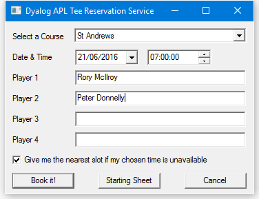
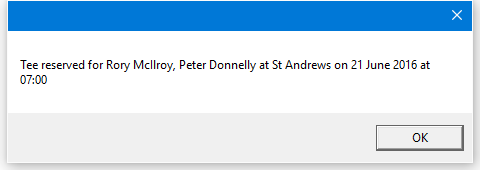
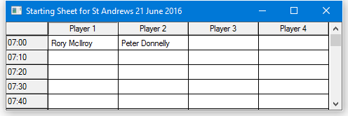

# Using GolfService from Dyalog APL

The workspace samples\asp.net\webservices\webservices contains functions that present a GUI interface to the GolfService web service.

The `GOLF` function accesses GolfService through a proxy class. `GOLF` is called with an argument of 0 or 1. Use 1 to force `GOLF` to create or rebuild the proxy class, which it does by calling `MakeProxy`. You must use an argument of 1 the first time you call `GOLF`, or if you ever change the GolfService APL code.

Note that you cannot make the proxy for GolfService unless the Web Server class has been compiled on the server. At present, the only way to trigger the compilation of golf.asmx into a Web Service is to visit the page once using Internet Explorer as described in the previous chapter.

The first few lines of the function are listed below. If the argument is 1, line[2] makes the proxy class GolfService.DLL in the current directory; if not it is assumed to be there already. Line[6] defines `⎕USING` to use it, and Line[7] creates a new instance which is assigned to `GS`. Line[8] calls the GetCourses method, which returns a vector of GolfCourse objects. Notice how namespace reference array expansion is used to extract the course codes and names from the Code and Name fields respectively.
```apl
     ∇ GOLF FORCE;F;DLL;COURSES;COURSECODES;N;GS;⎕USING
[1]    :If FORCE≢0
[2]        DLL←MakeProxy 
             'http://localhost/dyalog.net/golf/golf.asmx'
[3]    :Else
[4]        DLL←'.\GolfService.dll'
[5]    :EndIf
[6]    ⎕USING←'System'(',',DLL)
[7]    GS←⎕NEW GolfService
[8]    COURSECODES COURSES←↓⍉↑GS.GetCourses.(Code Name)
```

The following screen shot illustrates the user interface provided by `GOLF`. In this example, the user has typed the names of two golfers (one rather more famous than the other - at least in APL circles) and then presses the *Book it!* button.



This action fires the `BOOK` callback function which is shown below.
```apl
     ∇ BOOK;CCODE;YMD;HOUR;MINUTES;FLAG;NAMES;BOOKING;M
[1]    CCODE←⊃F.COURSE.SelItems/COURSECODES
[2]    YMD←3↑F.DATE.(IDNToDate⊃DateTime)
[3]    HOUR MINUTES←2↑1↓F.TIME.DateTime
[4]    FLAG←1=F.Nearest.State
[5]    NAMES←F.(Name1 Name2 Name3 Name4).Text
[6]    BOOKING←GS.MakeBooking CCODE
        (⎕NEW DateTime (YMD,HOUR MINUTES 0)),FLAG,NAMES
[7]    'M'⎕WC'MsgBox'
[8]    :If BOOKING.OK
[9]        M.Text←'Tee reserved for
             ',¯2↓⊃,/BOOKING.TeeTime.Players,¨⊂', '
[10]       M.Text,←' at ',BOOKING.Course.Name
[11]       M.Text,←' on ',BOOKING.TeeTime.Time.
            (ToLongDateString,' at ',ToShortTimeString)
[12]   :Else
[13]       M.Text←BOOKING.(Course.Name,'',
                   TeeTime.Time.(ToLongDateString,
            ' at ',ToShortTimeString),' ',Message)
[14]   :EndIf
[15]   ⎕DQ'M'
     ∇
```

Line[6] calls the MakeBooking method of the `GS` object, passing it the data entered by the user. The result, a Booking object, is assigned to `BOOKING`. Line[8] checks its OK field to tell whether or not the reservation was successful. If so, lines[9-11] display the message box illustrated below.

Notice how the various fields are extracted and notice how the ToLongDateString and ToShortTime String methods are employed.



Pressing the **Starting Sheet** button runs the `SS` callback listed below.
```apl
    ∇ SS;CCODE;YMD;M;SHEET;OK;COURSE;TEETIME;S;DATA;N
        ;TIMES
[1]    CCODE←⊃F.COURSE.SelItems/COURSECODES
[2]    YMD←3↑F.DATE.(IDNToDate⊃DateTime)
[3]    SHEET←GS.GetStartingSheet CCODE(⎕NEW DateTime YMD)
[4]    :If SHEET.OK
[5]        DATA←↑(SHEET.Slots).Players
[6]        TIMES←(SHEET.Slots).Time
[7]        'S'⎕WC'Form'('Starting Sheet for ',
              SHEET.Course.Name,' ',
              SHEET.Date.ToLongDateString)
              ('Coord' 'Pixel')('Size' 400 480)
[8]        'S.G'⎕WC'Grid'DATA(0 0)(S.Size)
[9]        S.G.RowTitles←TIMES.ToShortTimeString
[10]       S.G.ColTitles←'Player 1' 'Player 2'
                         'Player 3' 'Player 4'
[11]       S.G.TitleWidth←60
[12]       ⎕DQ'S'
[13]   :Else
[14]       'M'⎕WC'MsgBox'('Starting Sheet for ',
              SHEET.Course.Name,' ',
              SHEET.Date.ToLongDateString)
                         ('Style' 'Error')
[15]       M.Text←SHEET.Message
[16]       ⎕DQ'M'
[17]   :EndIf
     ∇
```

Line[3] calls the GetStartingSheet method of the `GS` object. The result, a StartingSheet object, is assigned to `SHEET`. Line[4] checks its OK field to see if the call succeeded. If so, lines[5-12] display the result in a Grid, which is illustrated below.


