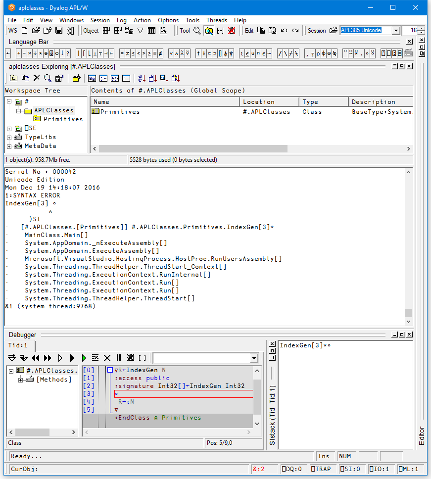

# Structure of the Active Workspace

Each engine which is started has a workspace associated with it that contains all the APL objects it is currently hosting.

Unless the highest isolation mode, **Each assembly has its own workspace** has been selected, the workspace will contain one or more namespaces associated with .NET *AppDomains*. When .NET calls Dyalog APL to process an APL class, it specifies the AppDomain in which it is to be executed. To maintain AppDomain isolation and scope, Dyalog APL associates each different AppDomain with a namespace whose name is that of the AppDomain, prefixed by `AppDomain_`.

Within each `AppDomain_` namespace, there will be one or more namespaces associated with the different Assemblies from which the APL classes have been loaded. These namespaces are named by the Assembly name prefixed by `Assembly_`. If the APL class is a Web Page or a Web Service, the corresponding Assembly is created dynamically when the page is first loaded. In this case, the name of the Assembly itself is manufactured by .NET. Below the `Assembly_` namespace is a namespace that corresponds to the .NET Namespace that represents the container of your class. If the APL class is a Web Page or Web Service, this namespace is called `ASP`. Finally, the namespace tree ends with a namespace that represents the APL class. This will have the same name as the class. In the case of a Web Page or Web Service, this is the name of the `.aspx` or `.asmx` file.

Note that in the manufactured namespace names, characters that would be invalid symbols in a namespace name are replaced by underscores.

The following picture shows the namespace tree that exists in the Dyalog DLL workspace when the first example (see [Example 1](../writing-net-classes/aplclasses1.md)) in the chapter Writing .Net Classes is executed under Visual Studio. However, to cause the suspension, an error has been introduced in the method  `IndexGen`.

In this case, there is a single AppDomain involved whose name, `DyApp_vshost_exe` is specified by .NET. APL has made a corresponding namespace called `AppDomain_DyApp_vshost_exe`. Next, there is a namespace associated with the Assembly `aplclasses`, named `Assembly_aplclasses`. Beneath this is a namespace called `APLClasses` associated with the .NET Namespace of the same name. Finally, there is the APL Class called `Primitives` .

Notice that the state indicator displays the entire .NET calling structure, and not just the APL stack. In this case, the state indicator shows that `IndexGen` was called from `MainClass.Main`, which combines the class and method names specified in `aplfns.cs`. Note that .NET calls are slightly indented.

Notice too that `IndexGen` has been started on APL thread 1 which, in this case, is associated with system thread 8752. If the client application were to call `IndexGen` on multiple system threads, this would be reflected by multiple APL threads in the workspace. This topic is discussed in further detail below.

The possibility for the client to execute code in several instances of an object at the same time requires that each executing instance is separated from all the others. Each instance will be created as an **unnamed** object in the workspace, within the relevant appdomain and assembly namespaces.

The picture below shows the workspace structure when the assembly was generated with isolation mode set to **Each assembly has its own workspace**. In this case, the AppDomain and Assembly structure is not created above the classes  in the workspace, so the workspace structure is somewhat simpler:

