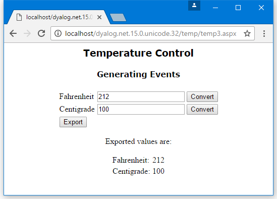

# The TemperatureConverterCtl3 Control

In the previous examples, events generated by control have been internal events, i.e. events that have been detected and processed internally by the control itself.

A separate requirement is to be able to design a custom control that generates *external* events, i.e. events that can be detected and handled by the page that is hosting the control. This example illustrates how to do this.

The TemperatureConverterCtl3 namespace is a copy of TemperatureConverterCtl2 with a couple of changes.

The first change is that it describes an event that the control is going to generate. This is done using  `⎕NQ` inside TemperatureConverterCtl3 like this:
```apl
   2 ⎕NQ '' 'SetEventInfo' 'Export'
               (('Double' 'Fahrenheit')
                ('Double' 'Centigrade'))

```

In this case, the name of the event is *Export* and it will report two parameters named *Fahrenheit* and *Centigrade* which are both of data type `Double`.

This version of the control presents a slightly different appearance to the previous one. The control itself is wrapped up in an HTML *Table,* with the conversion buttons arranged in a column. These buttons generate internal events that are caught and handled by the control itself. The third row of the table contains an additional button labelled *Export* which will generate the *Export* event when pressed. The `Render` function is shown below.
```apl
     ∇ Render output;TableRow;HTML;SET
[1]    :Access public override
[2]    :Signature Render  HtmlTextWriter output
[3]    TableRow←{
[4]        HTML←'<tr><td>',⍺,'</td><td><input name=',UniqueID
[5]        HTML,←' id=',⍺,'Value type=text '
[6]        HTML,←'value=',(⍕⍵),'></td>'
[7]        HTML,←'<td><input type=button value=Convert'
[8]        HTML,←' onClick="jscript:'
[9]        HTML,←(Page.GetPostBackEventReference ⎕THIS ⍺),'"></td></tr>'
[10]       HTML
[11]   }
[12]
[13]   HTML←''
[14]   HTML←'<table>'
[15]   HTML,←'Fahrenheit'TableRow _FahrenheitValue
[16]   HTML,←'Centigrade'TableRow _CentigradeValue
[17]
[18]   SET←'<tr><td><input type=button value=Export '
[19]   SET,←' onClick="jscript:'
[20]   SET,←Page.GetPostBackEventReference ⎕THIS'Export'
[21]   SET,←'"></td></tr>'
[22]   HTML,←SET,'</table>'
[23]   output.Write⊂HTML
     ∇

```

Notice that `Render[18]` causes the *Export* button to generate a Postback event which will call `RaisePostBackEvent` with the argument `'Export'`. Up to now, this is just an internal event just like the events generated by the conversion buttons.

The `RaisePostBackEvent`  propagates this event to the host page.

```apl
     ∇ RaisePostBackEvent eventArgument
[1]    :Signature IPostBackEventHandler.RaisePostBackEvent String eventArg
[2]    :Select eventArgument
[3]    :Case 'Fahrenheit'
[4]        _CentigradeValue←F2C _FahrenheitValue
[5]    :Case 'Centigrade'
[6]        _FahrenheitValue←C2F _CentigradeValue
[7]    :Case 'Export'
[8]        4 ⎕NQ'' 'Export'_FahrenheitValue _CentigradeValue
[9]    :EndSelect
     ∇

```

This is simply done by the third `:Case`  statement, so that when the function is invoked with the argument `'Export'`, it fires an Export event. This is done by line `[8]` using `4 ⎕NQ`. The elements of the right argument are:

| `[1]` | `''` | Specifies that the event is generated by this instance of the control |
| --- | --- | ---  |
| `[2]` | `'Export'` | The name of the event to be generated |
| `[3]` | `_FahrenheitValue` | The value of the first parameter, *Fahrenheit* |
| `[4]` | `_CentigradeValue` | The value of the second parameter, *Centigrade* |

It is then up to the page that is hosting the control to respond to the event in whatever way it deems appropriate.

### Hosting the Control on a Page

The following example illustrates an ASP.NET web page that hosts the TemperatureConverterCtl3 custom control and responds to its Export event. The page uses a <script> written in APL, but it could just as easily be written in VB.NET.
```apl
<%@ Register TagPrefix="Dyalog" Namespace="DyalogSamples"
                                Assembly="TEMP"%>
 
<script language="Dyalog" runat="server">
     ∇ ExportCB args;sender;e
[1]    sender e←args
[2]    (Flab Clab).Text←⍕¨e.(Fahrenheit Centigrade)
     ∇
</script>
 
<html>
<body>
<center>
<h3><font face="Verdana">Temperature Control
    </font></h3>
<h4><font face="Verdana">Generating Events
    </font></h4>
 
<form runat=server>
<Dyalog:TemperatureConverterCtl3 id="TempcvtCtl3"
        onExport="ExportCB"
runat=server/>
</form>
 
<p>Exported values are:</p>
<table>
<tr><td>Fahrenheit:</td>
    <td><asp:Label id="Flab" Text="" runat="server">
        </asp:Label></td>
</tr>
<tr><td>Centigrade:</td>
    <td><asp:Label id="Clab" Text="" runat="server">
        </asp:Label></td>
</tr>
</table>
</center>
</body>
</html>
```

In this example, the host page associates a callback function `ExportCB` with the **Export** event  The ExportCB callback function  is defined within the <script></script> section of the page. It simply sets the Text property of two Label controls to display the parameters reported by the event.

The picture below illustrates what happens when you run the page. Notice that the user can independently convert values between the two temperature scales and export these values from the control, to the host page, by pressing the Export button.


