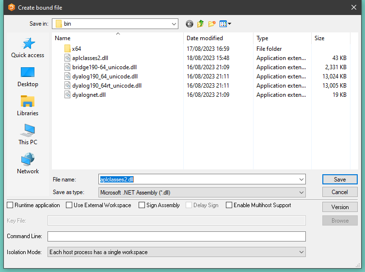
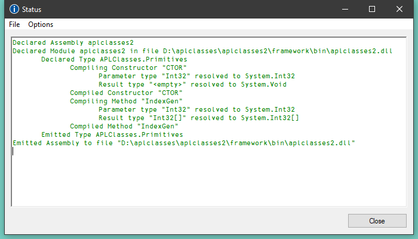
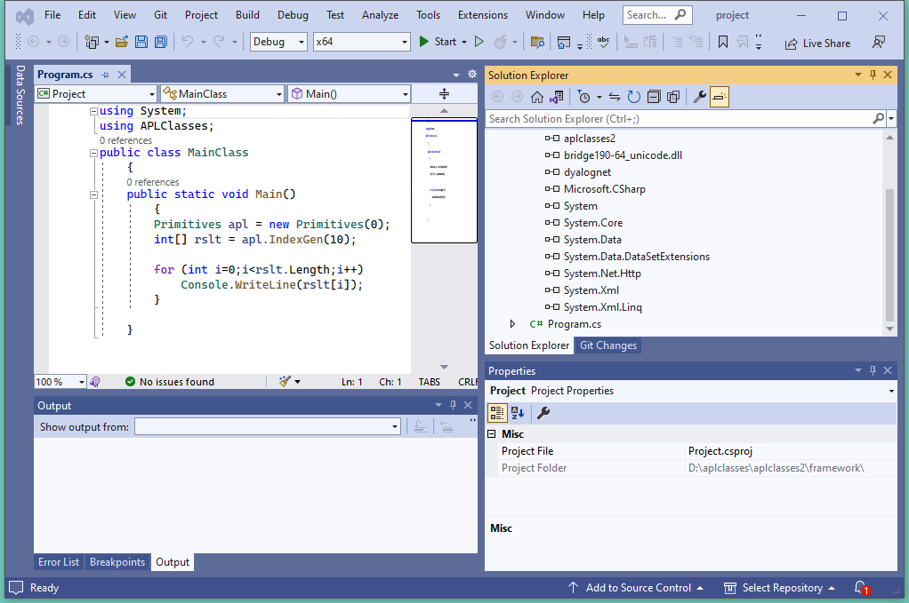
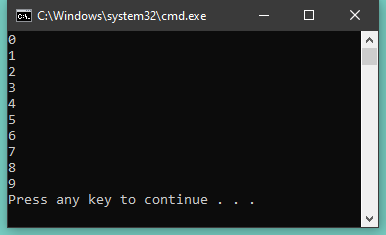

# Example 2

In Example 1, we said nothing about a constructor used to create an instance of the `Primitives` class. In Example 2, we will show how this is done.

In fact, in Example 1, APL supplied a default constructor, which is inherited from the base class (`System.Object`) and is called without arguments.

Example 2 will extend Example 1 by adding a constructor that specifies the value of `⎕IO`.

Load the workspace `aplclasses2.dws` from `aplclasses2`, then display the `Primitives` class:
```apl
      ↑⎕SRC APLClasses.Primitives
:Class Primitives                      
:Using System                          
                                       
    ∇ CTOR IO                          
      :Implements constructor          
      :Access public                   
      :Signature CTOR Int32 IO         
      ⎕IO←IO                           
    ∇                                  
                                       
    ∇ R←IndexGen N                     
      :Access public                   
      :Signature Int32[]←IndexGen Int32
      R←⍳N                             
    ∇                                  
                                       
:EndClass ⍝ Primitives                 

```

This version of `Primitives` contains a *constructor* function called `CTOR` that simply sets `⎕IO` to the value of its argument. The name of this function is purely arbitrary.

Using this version,  build a new .NET Assembly using *File/Export**…* as before. Remember that  the *Build runtime assembly* checkbox is unchecked.





### program.cs

The following C# source, called `aplclasses2\Framework\program.cs`, will be used to call the new version of our Dyalog.NET class.
```apl
`using System;
      using APLClasses;
      public class MainClass
            {
            public static void Main()
                  {
                  Primitives apl = new Primitives(0);
                  int[] rslt = apl.IndexGen(10);
 
                  for (int i=0;i<rslt.Length;i++)
                  Console.WriteLine(rslt[i]);
                  }
            }`
```

The program is the same as in the previous example, except that the code that creates an instance of the `Primitives` class is simply changed to specify an argument; in this case 0.
```apl
`Primitives apl = new Primitives(0);`
```

Using VS, open the solution file`d:\aplclasses\aplclasses2\Framework\project.sln` and view `program.cs`.



Then click **Debug/Start Without debugging**(or press Ctrl+F5) to run the program. The results are shown in a console window.


