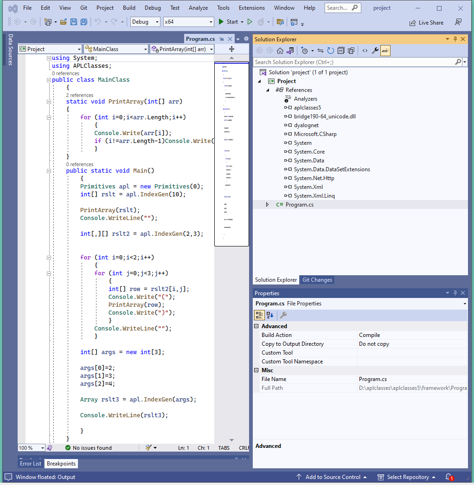

# Example 5

This example takes things a stage further and illustrates how you can implement *method overloading*.

In this example, the requirement is to export three different versions of the `IndexGen` method; one that takes a single number as an argument, one that takes two numbers, and a third that takes any number of numbers. These are represented by three functions named `IndexGen1`, `IndexGen2` and `IndexGen3` respectively. Because monadic `⍳` performs all of these operations, the three APL functions are in fact identical. However, their public interfaces, as defined in their`:Signature`statement, are all different.

The overloading is achieved by entering the same name for the exported method (`IndexGen`) in the box provided, for each of the three APL functions.

`aplclasses5.dws` contains a new version of the `Primitives` class with three different versions of `IndexGen` as shown below:
```apl

 
     ∇ R←IndexGen1 N
[1]   :Access public
[2]   :Signature Int32[]←IndexGen Int32 N
[3]    R←⍳N
     ∇
```

This is the version we have seen before. The method is defined to take a single argument of type `Int32`, and to return a 1-dimensional array (vector) of type `Int32`.
```apl
     ∇ R←IndexGen2 N
[1]   :Access public
[2]   :Signature Int32[][,]←IndexGen Int32 N1, Int32 N2
[3]    R←⍳N
     ∇
```

This version is defined to take two arguments of type `Int32`, and to return a 2-dimensional array, each of whose elements is a 1-dimensional array (vector) of type `Int32`.
```apl
     ∇ R←IndexGen3 N
[1]   :Access public
[2]   :Signature Array←IndexGen Int32[] N
[3]    R←⍳N
     ∇
```

In principle, we could define 7 more different versions of the method, taking 3, 4, 5 etc. numeric parameters. Instead, this method is defined more generally, to take a single parameter that is a 1-dimemsional array (vector) of numbers, and to return a result of type `Array`. In practice we might use this version alone, but for a C# programmer, this is harder to use than the two other specific cases.

Notice also that all function use the same descriptive name, <`IndexGen`>.

Load `aplclasses5.dws` and export `aplclasses5.dll` as before.


### program.cs

`samples\APLClasses\aplfns5.cs`contains code to invoke the three different variants of `IndexGen`, in the new `aplclasses.dll`. Notice that it uses a local sub-routine `PrintArray()`.
```apl
      using System;
      using APLClasses;
      public class MainClass
            {
            static void PrintArray(int[] arr)
            {
                  for (int i=0;i<arr.Length;i++)
                      {
                      Console.Write(arr[i]);
                      if (i!=arr.Length-1)
                         Console.Write(",");
                      }
            }
            
            public static void Main()
                  {
                  Primitives apl = new Primitives(0);
                  int[] rslt = apl.IndexGen(10);
                  PrintArray(rslt);
                  Console.WriteLine("");

                  int[,][] rslt2 = apl.IndexGen(2,3);
                  for (int i=0;i<2;i++)
                           {
                           for (int j=0;j<3;j++)
                                    {
                                    int[] row = rslt2[i,j];
                                    Console.Write("(");
                                    PrintArray(row);
                                    Console.Write(")");
                                    }
                  Console.WriteLine("");
                           }

                  int[] args = new int[3];
                  args[0]=2;
                  args[1]=3;
                  args[2]=4;
                  Array rslt3 = apl.IndexGen(args);
                  Console.WriteLine(rslt3);

            }

```

Using VS, open the solution file`d:\aplclasses\aplclasses2\Framework\project.sln` and view `program.cs`.



Click **Debug/Start Without debugging**(or press Ctrl+F5) to run the program. The results are shown in a console window.


It is possible for a function to have several `:Signature` statements. Given that our three functions perform exactly the same operation, it might have made more sense to use a single function:
```apl
     ∇ R←IndexGen1 N
[1]   :Access public
[2]   :Signature Int32[]←IndexGen Int32 N
[3]   :Signature Int32[][,]←IndexGen Int32 N1, Int32 N2
[4]   :Signature Array←IndexGen Int32[] N
[5]    R←⍳N
     ∇
```
