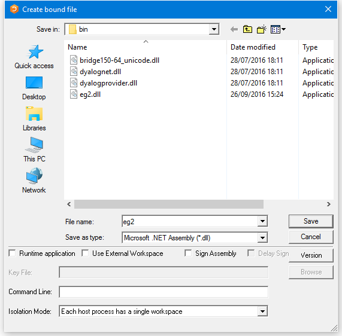
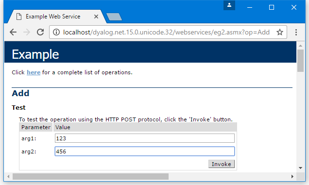

# Sample Web Service: EG2

In all the previous examples, we have relied upon ASP.NET to compile the `APLScript` into a .NET class prior to running it. This sample illustrates how you can make a .NET class yourself.

For this example, the Web Service script, which is supplied in the file s`amples\asp.net\webservices\eg2.asmx` (mapped via an IIS Virtual Directory to the URL `http://localhost/dyalog.net/webservices/eg2.asmx)`is reduced to a single statement that merely invokes the pre-defined class called `APLServices.Example`.

The entire file, viewed in `Notepad`, is shown below.


Given this instruction, ASP.NET will locate the `APLServices.Example` Web Service by searching the `bin` sub-directory for assemblies. Therefore, to make this work, we have only to create a .NET assembly in `samples\asp.net\aplservices\bin`. The assembly should contain a .NET Namespace named `APLServices`, which in turn defines a class named `Example`.

The procedure for creating .NET classes and assemblies in Dyalog APL was discussed in [Writing .NET Classes in Dyalog APL on page 1](../Writing .Net Classes/Chapter Heading.htm#Chapter_Heading). Making a WebService class is done in exactly the same way.

Note that the sub-directory `samples\asp.net\aplservices\bin` already contains copies of the dependent Dyalog DLLs that are required to execute the code.

**Start Dyalog as Administrator.** This is essential both to allow you to create an assembly.

Starting with a `CLEAR WS`,  create a namespace called `APLServices`. This will act as the container corresponding to a .NET Namespace in the assembly.
```apl
      )NS APLServices
#.APLServices
```

Within `APLServices`, create a class called `Example` that inherits from System.Web.Services.WebService. This is the Web Service class.
```apl
      )CS APLServices
#.APLServices
      )ED ○Example

:Class Example: WebService                        
:Using System                                     
:Using System.Web.Services,System.Web.Services.dll
    ∇ R←Add arg                                   
      :Access webmethod                           
      :Signature Int32←Add Int32 arg1, Int32 arg2 
      R←+/arg                                     
    ∇                                             
:EndClass                             
```

Within `APLServices.Example`, we have a function called `Add` that will represent the single method to be exported by this Web Service.

Fix the class, then click**File/Save As ...**in the Session menubar and save the workspace in `samples\asp.net\aplwebservices\bin`.
```apl
C:\Program Files\Dyalog\Dyalog APL 15.0 Unicode\Samples\asp.net\webservices\bin\eg2.dws saved Mon Sep 26 15:31:56 2016

```

Select the **Export…** item from the Session **File** menu, and save the assembly as `eg2.dll` in the same directory, i.e. `samples\asp.net\webservices\bin`.



When you click **Save**, the Status Window displays the following information to confirm that the assembly has been created correctly.


### Testing EG2 from a Browser

If you point your browser at the URL:
```apl
``http://localhost/dyalog.net.15.0.unicode.32/webservices/eg2.asmx``
```

ASP.NET will fabricate a page about it for the browser to display as shown below.

The `Add` method exposed by `APLServices.Example` is shown, together with a Form from which you can invoke it.



If you enter the numbers 123 and 456 in the fields provided, then press **Invoke**, the method will be called and the result displayed as shown below.


