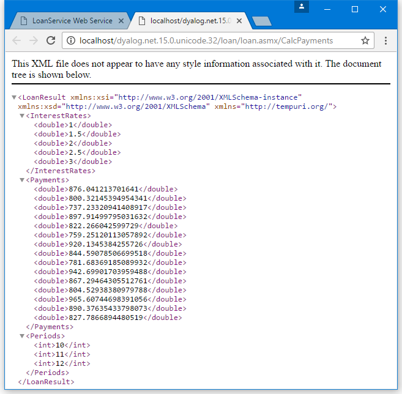

# Sample Web Service: LoanService

The LoanService sample is supplied in Dyalog\Samples\asp.net\Loan\Loan.asmx, which is mapped via an IIS Virtual Directory to the URL:
```apl
 http://localhost/dyalog.net.15.0.unicode.32/Loan/Loan.asmx
```

This APLScript sample defines a class named LoanService that is based upon`System.Web.Services.WebService`. The LoanService class defines a sub-class called LoanResult and a method called CalcPayments.
```apl
<%@ WebService Language="Dyalog" Class="LoanService" %>
:Class LoanService: System.Web.Services.WebService
:Using System
    :Class LoanResult
    :Access public
        :Field Public Int32[] Periods
        :Field Public Double[] InterestRates
        :Field Public Double[] Payments
    :EndClass
 
    ∇ R←CalcPayments X;LoanAmt;LenMax;LenMin;IntrMax;
                     IntrMin;PERIODS;INTEREST;NI;NM
[1]   :Access WebMethod
[2]   :Signature LoanResult←CalcPayments Int32 LoanAmt,
                        Int32 LenMax,Int32 LenMin,
                        Int32 IntrMax,Int32 IntrMin
[3] 
[4]  ⍝ Calculates loan repayments
[5]  ⍝ Argument X specifies:
[6]  ⍝   LoanAmt     Loan amount
[7]  ⍝   LenMax      Maximum loan period
[8]  ⍝   LenMin      Minimum loan period
[9]  ⍝   IntrMax     Maximum interest rate
[10] ⍝   IntrMin     Minimum interest rate
[11]
[12]   LoanAmt LenMax LenMin IntrMax IntrMin←X
[13]   R←⎕NEW LoanResult
[14]   R.Periods←¯1+LenMin+⍳1+LenMax-LenMin
[15]   R.InterestRates←0.5ׯ1+(2×IntrMin)+⍳1+2×
                   IntrMax-IntrMin
[16]   NI←⍴INTEREST←R.InterestRates÷100×12
[17]   NM←⍴PERIODS←R.Periods×12
[18]   R.Payments←,(LoanAmt)×((NI,NM)⍴NM/INTEREST)÷
                   1-1÷(1+INTEREST)∘.*PERIODS
     ∇
:EndClass
```

CalcPayments takes five integer parameters (see comments for their descriptions) and returns an object of type LoanResult.

Note that the block of APLScript that defines the sub-class LoanResult must reside between the `:Class` and `:EndClass` statements of the main class, LoanService. You may define any number of internal classes in this way.

The LoanResult class is made up only of Fields and it does not export any methods or properties. Furthermore, there are no constructor methods defined and it relies solely on its default constructor that is inherited from its base class, System.Object. The default constructor is called without any parameters and in fact does nothing except to create an instance of the class. In particular, the fields it contains initialised to zero. In this case, that is sufficient, as all the fields will be filled in explicitly later.
```apl
    :Class LoanResult
    :Access public
        :Field Public  Int32[] Periods
        :Field Public Double[] InterestRates
        :Field Public Double[] Payments
    :EndClass
```

The `:Class` statement starts the definition of a new class and specifies its name. The `:EndClass` statement terminates it definition.

The three `:Field` declaration statements specify the names and data types of three public fields. The `Public` attributes are necessary to make the fields visible to methods within the `LoanService` class as a whole, as well as to external clients.

The `Periods` field is defined to be an array of integers; the `InterestRates` field an array of Double. Both these arrays are 1-dimensional, i.e. vectors. These will contain the numbers of years, and the different interest rates, to which the repayments matrix applies.

Notice however that `Payments` is also defined to be 1-dimensional when in fact it is, more naturally, a 2-dimesional matrix. The reason for this is that, currently, Web Services do not support multi-dimensional arrays. This is a .NET restriction and not a Dyalog restriction.

`CalcPayments[13]` gets a new instance of the `LoanResult` class by doing `⎕New LoanResult`. It then assigns values to each of the three fields in lines `[14]`, `[15]`and `[18]`.

### Testing LoanService from a Browser

Like the methods exported by the APLEXample Web Services described above, the CalcPayments method exported by LoanService is callable from a browser and the page that is displayed when you point a browser at it is shown below.


To test the CalcPayments method, you can enter numbers into the form fields in this page, as shown in the screen shot above, and then press the **Invoke** button. The result of the method is then displayed in a separate window as illustrated below.

Notice that the result is described using XML, which is in fact the very language used to invoke a Web Service and return its result.

You can see that the result is of type LoanResult, and it contains 3 fields named Payments, InterestRates and Periods. This information was derived by our definition of the LoanResult class in the APLScript file.

As you can see, the InterestRates field shows that it contains a vector of floating-point values (double) from the minimum rate to the maximum rate that we specified on the input form. This time, the increment is 0.5.

Similarly, the Payments field contains the calculated repayment values.

Finally the Periods field, contains a vector of integers from the minimum period to the maximum period that we specified on the input form, in increments of 1.


